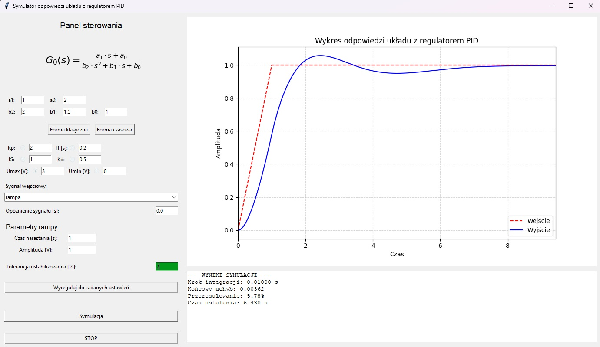

---

# Symulator odpowiedzi układu z regulatorem PID — dokumentacja implementacji

Poniższa dokumentacja opisuje tylko i wyłącznie zachowanie i strukturę tego konkretnego symulatora, tak jak zostało zaimplementowane w plikach `main.py`, `simulator.py`, `mathFunctions.py` i `tooltip.py`.

---

## Cel projektu

Interaktywny symulator układu drugiego rzędu sterowanego regulatorem PID z filtrem D i prostym anty-windup. Pozwala na ręczną konfigurację transmitancji, parametrów PID, ograniczeń saturacji oraz wyboru sygnału wejściowego, a także uruchomienie automatycznego strojenia (Nelder-Mead) wykorzystującego miary z symulacji.



---

## Pliki i ich rola

- `main.py` — GUI (Tkinter): pola wejściowe, walidacja, wywołania `Simulator`, okno auto-regulacji, logi i rysowanie wykresu.
- `simulator.py` — klasy sygnałów (`Ramp`, `FiniteSquare`, `SineWave`, `TriangleWave`) oraz `Simulator` realizujący: integrację (RK4), PID, saturację, anty-windup, zbieranie metryk i auto-strojenie (Nelder-Mead).
- `mathFunctions.py` — operacje macierzowe, `rk4_step`, funkcje `tf` i `ssdata` (przekształcenie TF->A,B,C,D), funkcja kosztu `pid_cost_function` i implementacja `nelder_mead`.
- `tooltip.py` — helper do wyświetlania podpowiedzi w GUI.

---

## Jak uruchomić

1. Utwórz i aktywuj virtualenv, zainstaluj zależności z `requirements.txt`.

```bash
python -m venv venv
source venv/bin/activate
pip install -r requirements.txt
python main.py
```

---

## Dokładny model obiektu użyty w symulatorze

Transmitancja:

$$
G_0(s)=\frac{a_1 s + a_0}{b_2 s^2 + b_1 s + b_0}
$$

W kodzie (`simulator.py`) ta transmitancja jest konwertowana do postaci stanu (A,B,C,D) przez `mf.tf(...)` i `mf.ssdata(...)`.

---

## Szczegóły implementacji regulatora PID

- Równanie sterowania w pętli symulacji (`Simulator.run`):

  - $D_{raw} = \frac{e - e_{prev}}{dt}$
  - $\alpha = \frac{T_f}{T_f + dt}$
  - $Df = \alpha D_{f_{prev}} + (K_d(1 - \alpha))D_{raw}$
  - $u_{raw} = K_p e + K_i I + D_f$
  - $u = clip(u_{raw}, U_{min}, U_{max})$

- Interpretacja parametrów przekazywanych do `Simulator` (parametr `params` w `main.py`):

  `[a1, a0, b2, b1, b0, Kp, Tf, B, A, Umax, Umin, tolerance, start_delay]`

  gdzie w kodzie `A` = `Ki` (jeśli forma klasyczna) lub `Kp/Ti` (jeśli forma czasowa), oraz `B` = `Kd` (klasyczna) lub `Kp*Td` (czasowa).

---

## Filtr na wyjściu członu różniczkującego

- Filtr D implementowany jest jako jednoparametrowy filtr IIR z parametrem `alpha = Tf/(Tf+dt)` i wykorzystaniem poprzedniej wartości `Df_prev` (patrz wyżej). `Tf` pochodzi z GUI (`self.pid_vars['Tf']`).

---

## Saturacja i anty-windup

- Saturacja: `u = mf.clip(u_raw, Umin, Umax)`.
- Anty-windup (clamping): całka `I` jest aktualizowana tylko, gdy `u_raw == u` (nie było cięcia) lub gdy `u_raw * e <= 0` (uchyb działa w kierunku odklejenia od nasycenia). W przeciwnym razie `I` nie jest aktualizowane.

---

## Integracja i dobór kroku

- Integracja stanu obiektu wykonywana jest funkcją `mf.rk4_step` (RK4).
- Krok `dt` jest wyznaczany dynamicznie przez obiekt sygnału wejściowego za pomocą metody returnStep(t_min). Dla sygnałów skokowych zależy od czasu narastania/trwania, natomiast dla sygnału sinusoidalnego (SineWave) krok jest zagęszczony do wartości 100 próbek na okres. Warto przed uruchomieniem autoregulacji wprowadzić równy punkt początkowy regulatora, ponieważ sam proces strojenia odbędzie się wtedy szybciej.

---

## Sygnały wejściowe

- `FiniteSquare(duration, amplitude)`
- `Ramp(raise_time, amplitude)`
- `SineWave(frequency, amplitude, delay=0)`
- `TriangleWave(raise_time, fall_time, amplitude)`


---

### Opóźnienie podania sygnału (Start Delay)

Parametr opóźnienia startu sygnału (w GUI jest pod listą sygnałów wejściowych). Wpływa on na generowanie sygnału referencyjnego $r(t)$ w pętli głównej według zależności:

- Jeśli $t < t_{\mathrm{delay}}$, wówczas $r(t) = 0.0$
- Jeśli $t \ge t_{\mathrm{delay}}$, wówczas:

$$r(t) = \text{signal\_object.getValue}(t - t_{\mathrm{delay}})$$

---

## Metryki

- `IAE`, `ISE`, `ITAE`, `ITSE` kumulowane w pętli.
- Przy zakończeniu symulacji `Simulator.metrics` zawiera: `step`, `final_e`, `overshoot`, `settling_time`, `IAE`, `ISE`, `ITAE`, `ITSE`.

---

## Kryteria stopu

- Główna reguła zakończenia: jeśli uchyb `abs(e) <= ep` (gdzie `ep = tolerance * amplitude`) i `signal_object.getSettlingTime() < t`, to inkrementowany jest `steady_counter`.
- Jeśli `steady_counter > 300` symulacja zostaje zakończona.
- Dla `SineWave` dodatkowy warunek: symulacja kończy się, gdy `t > 6 / frequency` (po 6 okresach).

---

## Auto-strojenie

- Optymalizator: lokalna implementacja Nelder-Mead dostępna w `mathFunctions.nelder_mead`. `Simulator.auto_tune` wywołuje ją z parametrami `step=0.3` i `max_iter=40`.
- Punkt startowy używany przez optymalizator to wektor czterech parametrów: `x0 = [Kp, Ki, Kd, Tf]` (z aktualnych wartości regulatora). Parametr `Tf` jest włączony do optymalizacji w obecnej implementacji.

- Funkcja celu (`objective`) — dokładny przebieg:
  1. Przyjmuje testowane wartości `x = [Kp, Ki, Kd, Tf]`.
  2. Sprawdza ograniczenia twarde: `Kp <= 0` lub `Ki < 0` lub `Kd < 0` lub `Tf < 0.02` zwracają karę `1e12`. Dodatkowo sprawdza, czy nie przekroczono górnych limitów `max_Kp`, `max_Ki`, `max_Kd` (wartości z GUI) — naruszenie również daje `1e12`.
  3. Tworzy tymczasowy `Simulator` z tymi parametrami i uruchamia go w pętli (`while Sim.run(): pass`).
  4. Po zakończeniu pobiera `Sim.metrics` i oblicza wartość funkcji kosztu wywołaniem `mathFunctions.pid_cost_function(Sim.metrics, quality_params)`.

- Implementacja `mathFunctions.pid_cost_function` używa wag i kryteriów wpisanych w GUI (`weight_overshoot`, `weight_speed`, `weight_ss`, `overshoot`, `settling_time`, `ss`) w celu dodania kar do wartości podstawowej metryki.

- Po zakończeniu optymalizacji najlepszy wektor `best` (czteroelementowy) jest zaokrąglany do dwóch miejsc i przypisywany jako nowe `Kp, Ki, Kd, Tf` (wartości zapisane w `self.A`, `self.B`, `self.Tf` oraz w GUI przez `main.py`).

### Kryteria jakości

W kodzie dostępne są cztery podstawowe metryki błędu (można je wybrać w GUI jako `cost_function`):

- IAE — Integral of Absolute Error:

$$
J_{\mathrm{IAE}} = \int_{0}^{T} |e(t)|dt
$$

- ISE — Integral of Squared Error:

$$
J_{\mathrm{ISE}} = \int_{0}^{T} e^2(t)dt
$$

- ITAE — Integral of Time-weighted Absolute Error:

$$
J_{\mathrm{ITAE}} = \int_{0}^{T} t|e(t)|dt
$$

- ITSE — Integral of Time-weighted Squared Error:

$$
J_{\mathrm{ITSE}} = \int_{0}^{T} te^2(t)dt
$$

Wszystkie są kumulowane dyskretnie w `Simulator` i dostępne w `Sim.metrics`.

### Funkcja kosztu używana w optymalizacji (dokładny wzór)

Niech $J_{\mathrm{base}}$ będzie wartością jednej z wybranych metryk (`IAE`/`ISE`/`ITAE`/`ITSE`) pobraną z `Sim.metrics`. Następnie obliczana jest kara `P` jako suma trzech składowych:

1) Kara za przeregulowanie (overshoot): jeśli $\mathrm{overshoot} > \mathrm{overshoot}_{\mathrm{req}}$,

$$
P_{\mathrm{ov}} = w_{\mathrm{ov}} \cdot (\mathrm{overshoot} - \mathrm{overshoot}_{\mathrm{req}})
$$

2) Kara za czas ustalania: jeśli istnieje `settling_time` i $\mathrm{settling\_time} > \mathrm{settling\_req}$,

$$
P_{\mathrm{ts}} = w_{\mathrm{ts}} \cdot (\mathrm{settling\_time} - \mathrm{settling\_req})
$$

W razie braku ustalenia (wartość `settling_time` równa `None`) stosowana jest duża kara zastępcza: $P_{\mathrm{ts}} = w_{\mathrm{ts}} \cdot 1000$.

3) Kara za uchyb ustalony (steady-state error): jeśli $|e_{\infty}| > ss_{\mathrm{req}}$,

$$
P_{\mathrm{ss}} = w_{\mathrm{ss}} \cdot (|e_{\infty}| - ss_{\mathrm{req}})
$$

Łączna kara: $P = P_{\mathrm{ov}} + P_{\mathrm{ts}} + P_{\mathrm{ss}}$.

Funkcja kosztu minimalizowana przez Nelder-Mead to:

$$
J = J_{\mathrm{base}} + 10000 \cdot P
$$

gdzie wagi $w_{\mathrm{ov}}, w_{\mathrm{ts}}, w_{\mathrm{ss}}$ oraz progi (`overshoot_req`, `settling_req`, `ss_req`) pochodzą z `quality_params` z GUI (`weight_overshoot`, `weight_speed`, `weight_ss`, `overshoot`, `settling_time`, `ss`).

### Sygnał sinusoidalny

Dla sygnału harmonicznego, pojęcia przeregulowania, uchybu ustalonego oraz czasu ustalania nie mają zastosowania fizycznego, więc w implementacji funkcji `pid_cost_function` wprowadzono sprawdzanie flagi `is_sine`. W przypadku wykrycia sygnału sinusoidalnego łączna wartość kary jest całkowicie pomijana (P = 0), a funkcja kosztu zwraca wyłącznie czystą wartość wybranej całki uchybu:

Dzięki temu optymalizator Nelder-Mead skupia się wyłącznie na minimalizacji wybranego błędu integralnego (np. IAE), dopasowując zarówno amplituda, jak i przesunięcie fazowe odpowiedzi układu bez nakładania sztucznych kar za brak ustalenia się sygnału.
